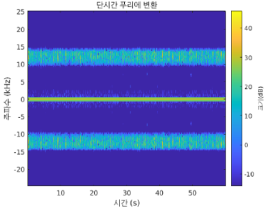
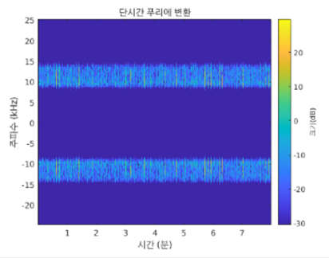
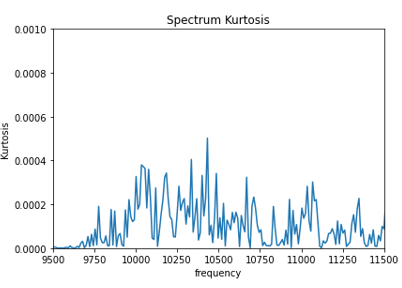
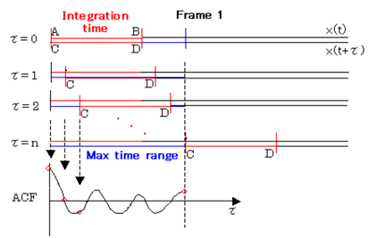
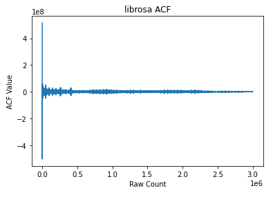
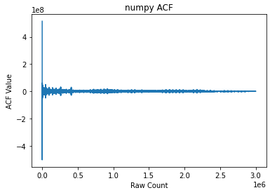
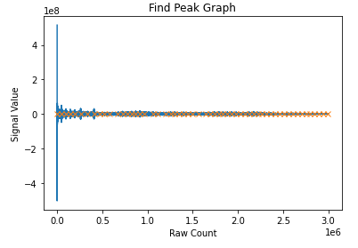
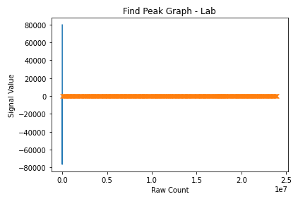
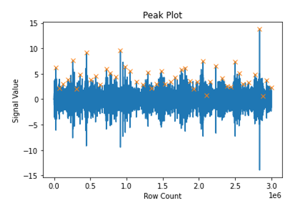
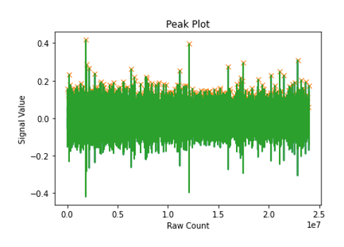

# Chain
체인은 스텝 체인과 구동 체인으로 분류가 가능하다.  
각각의 특성을 이용하여 링크 간격을 구하고 최종적으로 신율을 계산한다.  
측정된 신율을 HI 그래프의 입력 데이터로 활용하고 RUL을 예측한다.

## Bandpass Filter
잡음을 없애고 신호를 강조하기 위해 특정 대역폭을 지정하여 필터링을 한다.  
대역통과필터는 Matlab과 비교하여 가장 부합한 라이브러리를 사용한다.  
아래는 왼쪽부터 스텝 체인, 구동 체인의 필터링 결과다.  
  

## Min Variance
구동 체인의 경우에는 범용적으로 신호가 출력되는 대역폭만으로 필터링하기에는 현장의 환경 변수를 무시할 가능성이 있다.  
이를 방지하기 위해 체인의 링크간 길이는 거의 일정하다는 원리를 이용한다.  
특정 방식을 이용하여 대역폭을 세밀하게 분석하여 최적의 대역폭을 찾는다.  
최적의 대역폭의 기준은 피크 값을 구하고 해당 피크간 간격의 최소 분산 값을 이용한다.

## Bandstop Filter
대역통과필터를 이용하여 데이터를 필터링한 후에도 현장에서의 데이터에서 잡음으로 추정되는 주파수 대역 SFTP 를 통해 확인할 수 있다.  
     
(좌 현장, 우 실험실)  
해당 주파수 대역을 제거하기 위해 대역차단필터를 이용한다.   
   
주파수의 첨도 그래프를 이용하여 첨도가 높은 주파수 대역을 대상으로 다른 대상보다 비 정상적으로 첨도가 높은 주파수 대역을 선택하여 제거한다. (좌 제거 전, 우 제거 후)

## AutoCorrelation
스텝 체인은 구동 체인과 다르게 신호를 추출하는데 많은 어려움이 있다.  
스텝 체인의 신호를 추출하기 위해 자기상관함수를 이용한다.  

  
자기상관함수는 임의의 어떤 신호와 그 신호를 임의의 시간만큼 지연시킨 신호 사이의 상관관계를 파악할 수 있는 함수이다.  
상관관계는 유사성을 의미하는데, 지연 시간에 대해 초기 신호의 성분이 계속해서 지속되고 있다면 ACF는 높은 상관관계를 나타낼 것이다.  
반대로 초기 신호의 성분이 사라지고 거의 존재하지 않는다면 그 지연 시간에 대한 ACF는 낮은 상관관계를 나타낼 것이다.  
즉, 스텝의 소리가 주기적으로 발생하는데, ACF를 사용하면 초기 신호의 성분이 주기적으로 지속이 된다면 값이 높게 찍힐 것이고 여기에 피크 값을 찍으면, 스텝의 소리라고 할 수 있다.
  
자기상관함수를 사용하기에 앞서 파이썬에는 여러 라이브러리가 존재한다.  
각각의 라이브러리와 Matlab에서 제공하는 함수를 비교하여 라이브러리를 선택한다.  

  
위 그림과 같이 librosa, numpy에서 제공하는 자기상관함수의 결과는 동일하게 나오지만, numpy를 이용한 방식은 많은 시간을 필요하므로 librosa 방식을 사용한다.  

## Find Peak
체인의 링크 간격은 모든 구간에서 일정하므로 피크의 간격의 분산 또한 0에 가까운 값으로 측정될 것이다.  
이를 이용하여 스텝, 구동 각각의 특징을 이용하여 전처리를 한 후, 최종적으로 피크 값을 찍고 그 간격의 분산이 가장 작은 구간을 실제 신호가 측정되는 구간으로 가정한다.  

  
스텝 체인 같은 경우는 자기상관함수를 사용한 후에 피크 값을 찍는데, 시각적으로는 판별하기가 힘들지만 해당 결과를 통해 체인의 길이를 계산하면 실제 길이와 유사한 결과를 얻는다.  
(좌 현장, 우 실험실)  
   
구동 체인의 특징을 이용하여 전처리 과정을 진행 후, 피크 값을 찍은 그림이다.  
(좌 현장, 우 실험실)

# Gear

# Bearing